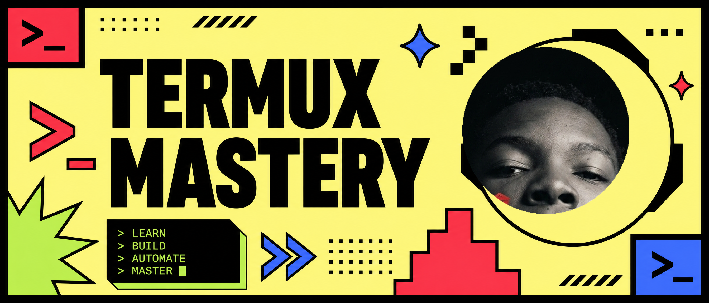

# Termux Mastery: Transform Android into a Dev Powerhouse

## About the Project
The complete guide to transforming Termux on Android into a development powerhouse. Each topic is carefully curated to provide you with the best experience in shell configuration, automation, and productivity.

## Author
**Fahad Mohamed Malibiche**
*Software Engineer from Tanzania*

## Features
- **Neo-Brutalism Design**: A bold, high-contrast user interface with continuous title animations.
- **Complete Guide**: From installation to advanced automation.
- **Rich Previews**: Optimized for WhatsApp and social media sharing.
- **Bootstrap Scripts**: One-command setup for your environment.

## Tech Stack
- **Frontend**: React, Vite, Tailwind CSS
- **Styling**: Neo-Brutalism CSS
- **Deployment**: Vercel

---
© 2026 Fahad Mohamed Malibiche
